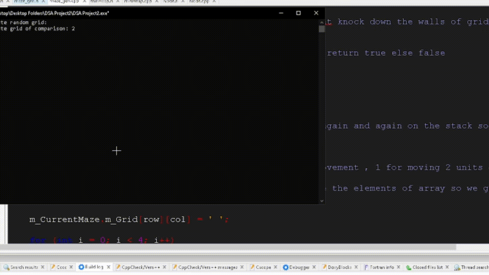

# MazeSolver-PathFinder
Maze pathfinding visualizer using BFS, DFS, and A*, built with Raylib in C/C++

This project visualizes three graph traversal algorithms on a maze. 
A* is implemented using a Priority Queue (MinHeap) and the graph 
is represented as an adjacency matrix.

DEPENDENCIES:
Raylib
C/C++ compiler (GCC / MSVC / Clang)

